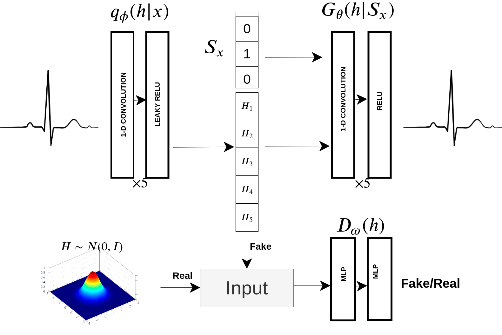

# AAECG: Anomaly detection on ECG signal using Adversarial AutoEncoder - Deep Generative Model

Can we teach a machine the normal behaviour of the heart and then have it use this knowledge to assess whether something is wrong? 

AAECG framework faces the problem of recognition of abnormal heartbeats inside the ECG signal by using modern data-driven techniques. Since the abnormal patterns are plentiful, rare and challenging to collect in a balanced dataset while the normal ones are pretty common, the framework tackles this problem in a/an semi-supervised/unsupervised manner. The model will learn the normal heartbeats variability, and it will use the knowledge acquired to infer the abnormality of new data. 

AAECG is a Deep Generative Model derived by an [Adversarial Autoencoder(AAE)](https://arxiv.org/abs/1511.05644) which captures the Sinus heartbeat distribution throughout a set of latent variables and additional patient gender information. The model is intended to monitor 24/7 patients in intensive care by alarming doctors only when abnormal heartbeats are detected. Tested on the MIT-BIH arrhythmia database, It reached 0.95 ROC-AUC and 0.92 PR-AUC outperforming the baselines and competing with the state-of-art.

Furthermore, the model shows to understand the sex differences between heartbeats, opening the possibility to study the effects of some conditions, drugs or other particular details on the normal heartbeat wave-form, opening a path towards more patient-specific diagnosis.

## The framework

AAECG is composed by a stochastic encoder, which maps an ECG into a 5 dimen-
sional vector. A decoder which reconstruct the ECG with the sex information joint to the hidden
vector. A discriminator distinguishes between samples generated from the encoder and from an
isotropic Gaussian.

## Results

The model is evaluated on the dataset excrated from the [MIT-BIH database](https://physionet.org/content/mitdb/1.0.0/). 
5-fold cross validation is used to assess performances.
AAECG is compared with other baseline models. 

| Model        | PR-AUC              | ROC-AUC            | F2 - score      |
| :---         |     :---:           |          :---:      | ---: |
| PCA          | 0.7026 ± 0.0048     | 0.8352 ± 0.0020    | 0.5324 ± 0.0041 |
| AutoEncoder     | 0.8731 ± 0.0043            | 0.9027 ± 0.0038       | 0.6685 ± 0.0275|
| [AnoBeat](https://ieeexplore.ieee.org/abstract/document/9172828)     |  0.9276 ± 0.0043            | 0.9596 ± 0.0038       |0.6710 ± 0.0345|
| AAECG     | 0.9204 ± 0.0043            | 0.9504 ± 0.0038       | 0.6726  ± 0.0275|

# Repository description
The repository is not intended for a user-friendly usage but just for research purpose.
Building up an automated pipeline would require additional work.
But here a brief description for curious.

- download the dataset [mit-bih](https://physionet.org/content/mitdb/1.0.0/) and run [the wrangler](Data_Wrangler.py) to clean and prepare the data
- [here](AAECG.pdf) you can find a deep description of the work, my thesis.
- [this](TRAIN_TEST_AAECG.ipynb) it is a friendly description of the codes for train and test the model
- the folder model, contains already trained model, which can be loaded and studied using [this](utils/explore_models.py)
